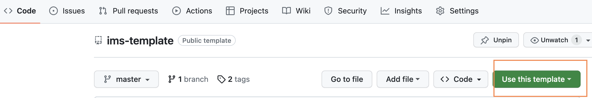
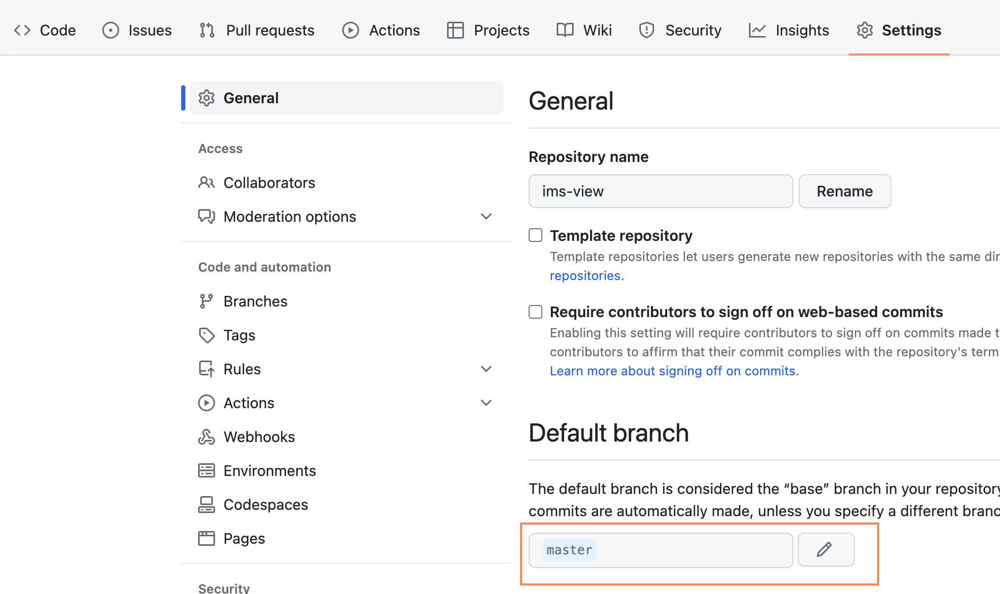
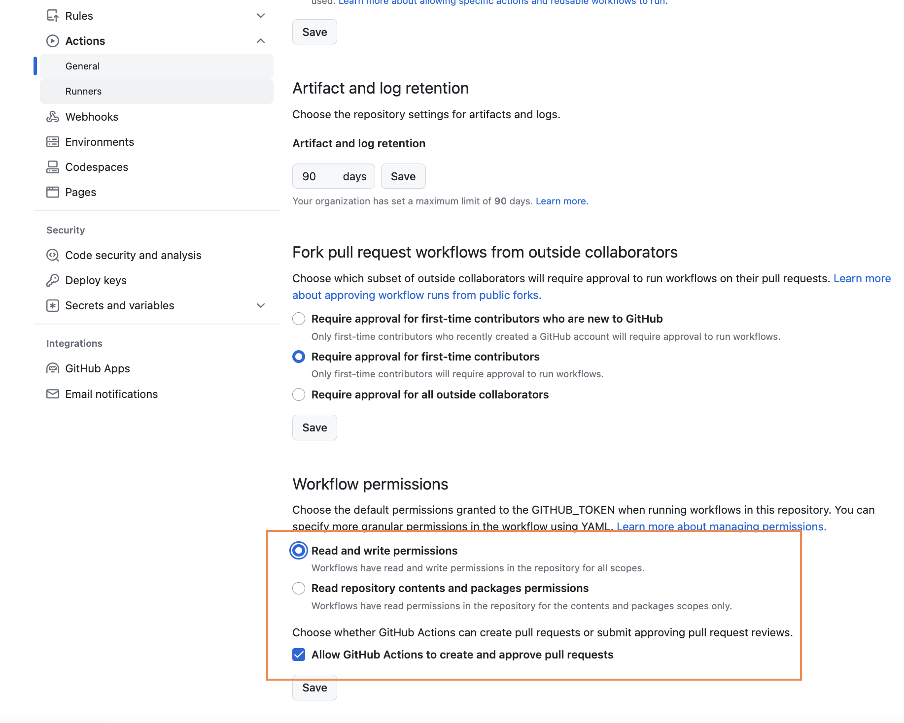
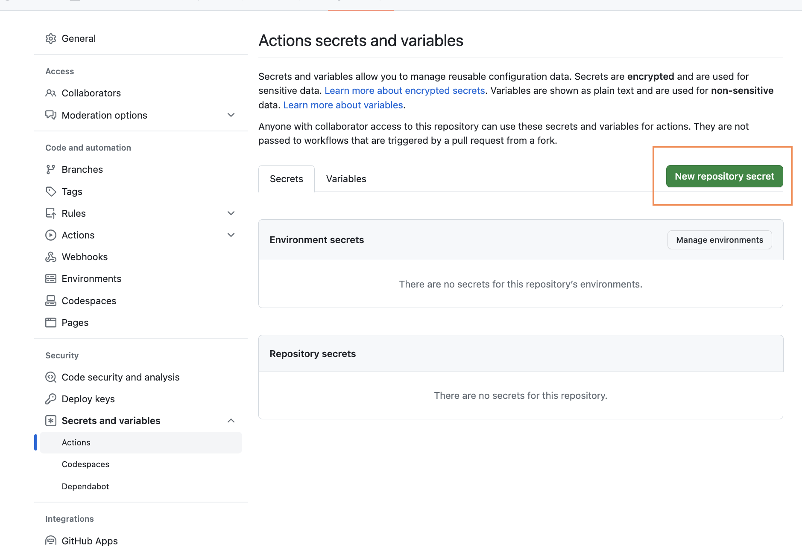
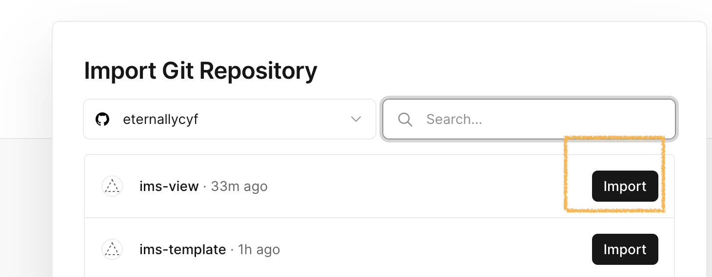
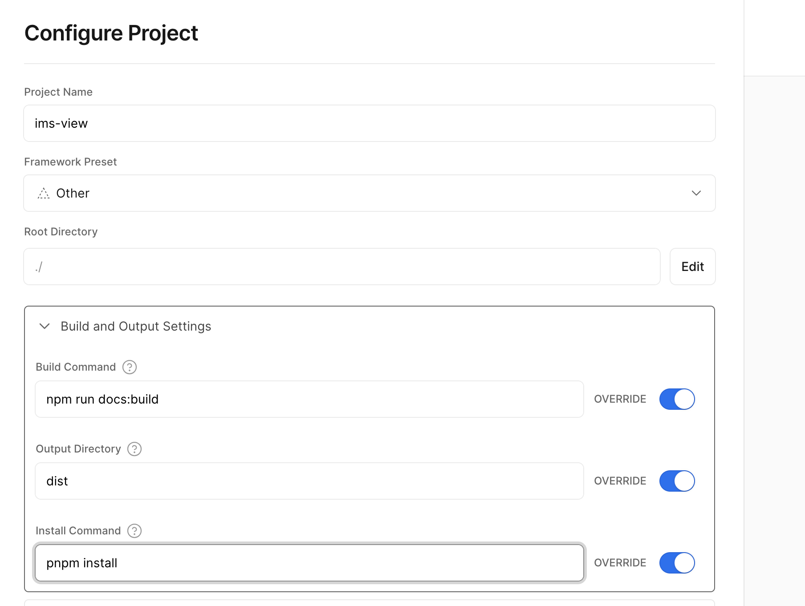

## Step1. 使用该模板创建一个新的仓库, 设置密匙及权限

- 点击右上角 `use this template` -> `create a new reposity` 按钮，创建一个新的仓库。
  - 
- `git clone xxx` 仓库到本地 并安装依赖 `pnpm i`
- 更换默认分支为 `master`
  - 
- 设置密匙及权限
  - `仓库/settings/Actions/General` 勾选读写权限
    - 
  - 设置仓库密匙
    - 
      - 分别设置 key 为 `GH_TOKEN` 及 `NPM_TOKEN`的密匙

:::info{title='密匙需要选择 Tokens(classic 类型),否则无法自动发包'}
GITHUB: 点击右上角头像
/settings/Developer settings/Personal assess tokens/Tokens(classic)/Generate new token(classic)
NPM: 点击右上角头像
/Access Tokens/Generate New Token/Classic Token
:::

## Step2. 配置自己本地环境配置(可以跳过 用流水线发)

```shell
npm install -g pnpm semantic-release-cli conventional-changelog
# macos编辑环境变量 (windows请自行设置)
vim .zprofile
# 添加
export GH_TOKEN=xxx
export NPM_TOKEN=xxx
# 更新文件
source ~/.zprofile
# 初始化semantic配置
semantic-release-cli setup --gh-token=xxx --npm-token=xxx --npm-username=xxx
```

:::info{title='本地 node 版本需要 v18.18.0 及以上(semantic-release)'}
nvm install v18.18.0
nvm use v18.18.0
:::

## Step3. 更换一些信息

- 全局搜索 `ims-template` 替换为 自己的包名
- [案例的 commit 差异记录](https://github.com/eternallycyf/ims-indexed-db/commit/ae780193edbfb996f3ab6e2239cdb6765a6855db)

## Step4. 搭建 Vercel

- 登录 [Vercel](https://vercel.com)
- 新建项目

  - 
  - 
  - 

- 点击 `deploy`

## Step5. 发一个 npm 包试试

- 全局替换

  - `ims-template` => 你的 `npm` 包名
  - `eternallycyf` => 你的 `github` 名称
  - 更换 package.json => version => 1.0.0
  - `git commit --allow-empty -m "✨ feat: npm publish"`
  - yarn changelog(更新变更历史)

:::info{title='以这些 git commit message 开头的会自动发包 构建生产'}
✨ feat: xxx
🐛 fix: xxx
:::
